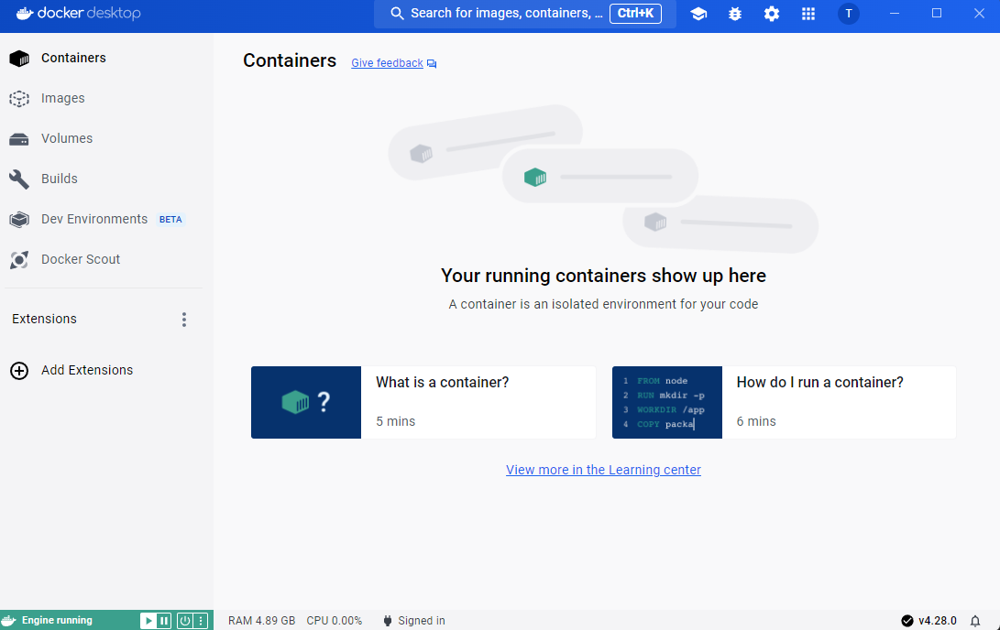
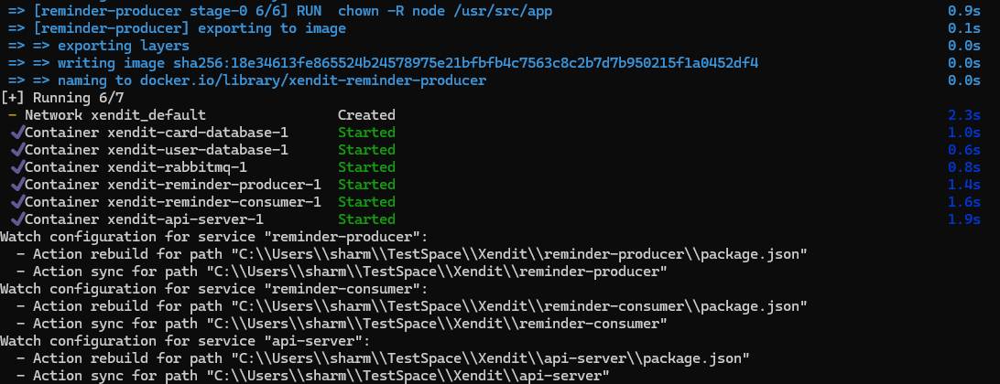
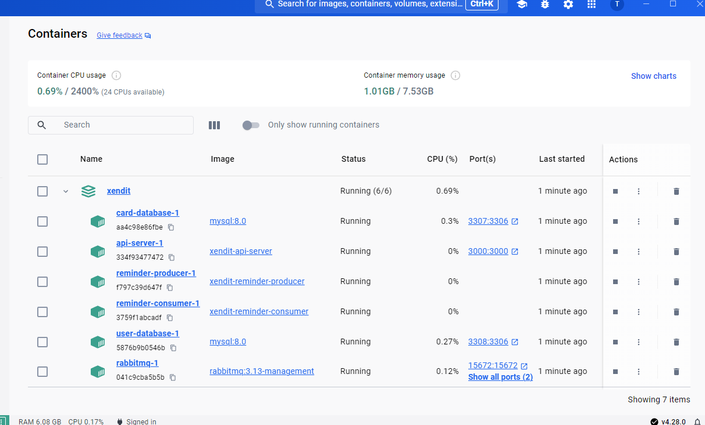
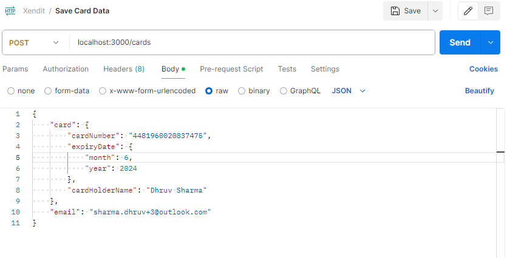
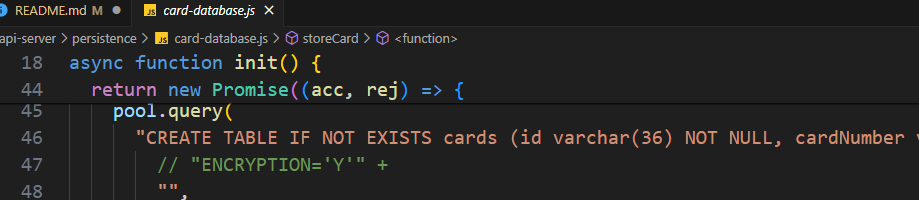
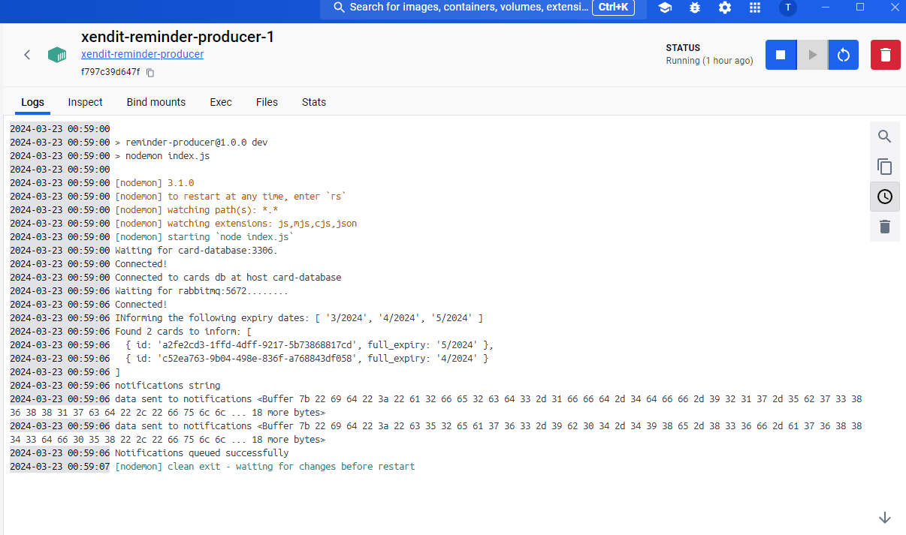

# Tokenisation and Card Expiry Notifications by Dhruv Sharma

This is a project created for the Xendit Take Home exercise.

## Setup for API Server

1. Install Docker Desktop from here: https://www.docker.com/products/docker-desktop/
   - Make sure both docker and docker compose cli tools are working.
2. Install Postman from here: https://www.postman.com/downloads/
3. MySQL Workbench from here: https://dev.mysql.com/downloads/workbench/
4. Once all of these are installed, pull the latest version of the code to your machine.
5. Start Docker Desktop, if you are running it for the first time, it should look like some below
   1. 
6. On your terminal, run `docker compose watch`. This can take around 10 minutes, the first time you run it.
7. After finishing, the log should look like something below:
   1. 
8. Your Docker Desktop should look something like this:
   1. 
9. Open Postman and click on Import. Use the cURL section and use the below mentioned cURL command to import in your Postman.

```
curl --location 'localhost:3000/cards' \
--header 'Content-Type: application/json' \
--data-raw '{
    "card": {
        "cardNumber": "4481960020837475",
        "expiryDate": {
            "month": 6,
            "year": 2024
        },
        "cardHolderName": "Dhruv Sharma"
    },
    "email": "sharma.dhruv+3@outlook.com"
}'
```

10. It should look something like this in Postman
    1.  
11. And once you click `Send`, you should receive a uuid which is the token created for your card data.

There you go, you have access to the first part of the exercise to store the card data

## Services

In the above image of Docker after you ran the `docker compose watch`, you should see 6 services under the XenditExercise group in the Containers Tab. Let's discuss what each of them does!

### API-Server

This service creates the server that is responsible for accepting card data from the merchant and encrypting it as well as storing that information between two different MySQL database servers. There are 4 things to note here:

1. The Data at Rest encryption is done when the tables are created at initialising of the service. But the code is commented out because it requires a 3rd party plugin to the [MySQL Keyring Configuration](https://dev.mysql.com/doc/refman/8.0/en/innodb-data-encryption.html). Which would require sharing of credentials.
   1. 
2. The Data in Transit is also handled here through the ssl setup and usage of certificates. The code is again commented out because self-signed certificates are not accepted in the MySQL setup here. We would need to create certificates using a trusted authority.
3. The data is split across two servers because of the need to separate the PAN data as well as the truncated card number, along with other PII data. So the card data is stored in the card database and the user-database along with the relation is stored in user-database.
4. I also wanted to double encrypt the PAN number, apart from the MySQL Data at Rest and Transit encryption. But that requires me to use a 3rd party like AWS KMS to store the key used and then would have to share the credentials. The comments are added in the **index.js(Line 113)** where the code would need to be added for encryption.

### Card-Database and User-Database

1. These two databases store the information needed to store the card data as well as send notification reminders.
2. In an production environment, they will have Keyring setup and that would encrypt them according to the PCI-DSS regualtions.
3. There are 3 tables built across these two database servers.

#### Card Database

**Cards Table**
| Column | Type |
|--|--|
| id | varchar(36)
| cardNumber | varchar(16)
| expiryMonth | integer
| expiryYear | integer
| cardHolderName | varchar(255)
| full_expiry | varchar(7)

#### User Database

**User Table**
| Column | Type |
|--|--|
| id | varchar(36) |
| email | varchar(255) |

**Cards Table**
| Column | Type |
|--|--|
| user_id | varchar(36) |
| card_id | varchar(36) |
| trunc_card_number | varchar(16)

### Rabbitmq

This is a straightforward rabbitmq broker that `reminder-producer` service uses to queue the tasks for reminder notifications whereas `reminder-consumer` consumes these tasks to send the emails and call the webhook.

### Reminder-Producer

This is a script that will need to run either through a cronjob or something like AWS lambda, at the start of every month(Jan 1, Aug 1, etc). It's job get the cards that are expiring in the next 3 months. It sends the card_ids and expiryDate to `Rabbitmq` as a task to be consumed by `reminder-consumer`.

### Reminder-Producer setup

Apart from the setup above, `reminder-producer` does have a couple of notes for it to run. As it is more of a script, supposed to controlled through cronjob or a scheduling system, after the docker compose starts it up, it shuts down gracefully unlike `reminder-consumer` which is supposed to keep running.

1. So to check if the system is working as expected, you should restart this service through the Docker Desktop app after you have added some cards in the db. Make sure to add some cards that are expiring in the next 3 months.
2. You can look at the logs here:
   
3. The button is in the top right corner as indicated in the picture.

### Reminder-Consumer

This is a worker service that connects to the `Rabbitmq` to send the emails and webhook calls. It also connects to the `user-database` to get the additional information such as _trunc_card_number_, _email_, etc. One thing to note, the code to send the email and call webhooks isn't present, as again that would require 3rd party integration and subsequent sharing of credentials. These can also be horizontally scaled to accomodate peak activity times.

## Limits

Given the short amount of time, there are some limits to the system that would require more research to solve and implement. Here are 2 of them:

1. It is possible to store the same card again in the system, the primary reason this is possible is because of the double encryption of the PAN that would require every PAN number to be decrypted to be compared to the input. I have thought about a hasing function and compare the hash values but again the problem is the [PCI DSS regulation](https://d30000001huxdea4.my.salesforce-sites.com/faq/articles/Frequently_Asked_Question/How-can-hashing-be-used-to-protect-Primary-Account-Numbers-PAN-and-in-what-circumstances-can-hashed-PANs-be-considered-out-of-scope-for-PCI-DSS#:~:text=PCI%20DSS%20requires%20that%20hashing,%2C%20or%20salt%2C%20be%20used.). I think there is definitely a way to do this by either storing the hash in the separate server/db, but I havent had the time to properly research about this.
